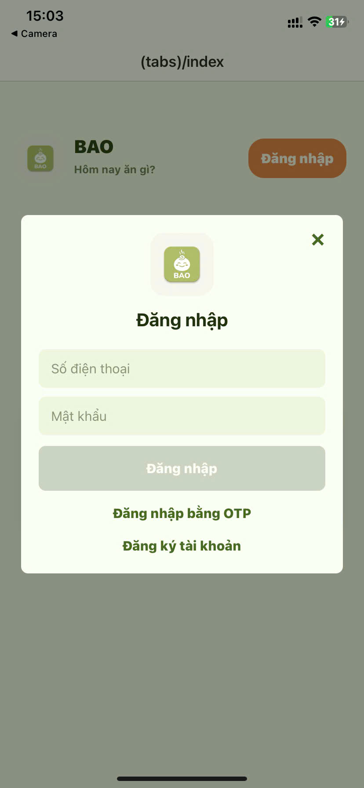
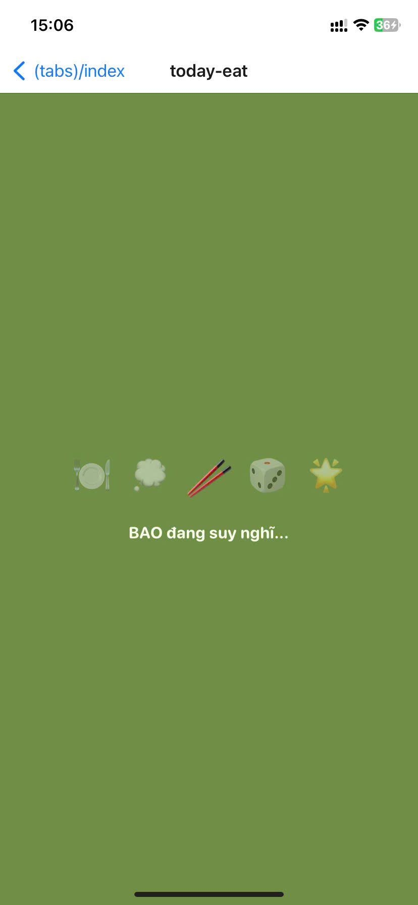
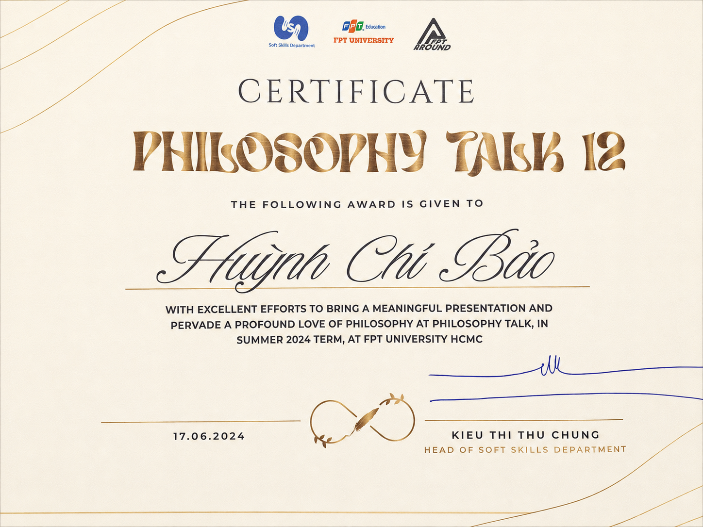

# Huynh Chi Bao — Personal Portfolio

  <h3>Backend & DevOps Engineer</h3>
  
Building reliable server systems, scalable platforms and practical digital products.

  

    <a href="https://profile.b4f.site"><strong>Visit the portfolio →</strong></a>
  

---

## About this portfolio

This is the personal portfolio of **Huynh Chi Bao**, a software engineer based in Ho Chi Minh City. It brings together my professional journey, selected work, personal products, skills, education and ways to get in touch.

The experience is designed as a focused editorial profile: dark, minimal and energetic, with a vivid lime accent that highlights the most important moments across the page.

## What you will find

- A concise introduction to who I am and how I approach engineering
- Selected experience and measurable outcomes from real-world products
- Personal projects shaped from early ideas into usable experiences
- A practical overview of the areas I work with
- Education, recognition and direct contact details

## Featured project — BAO FOR FOOD

**BAO FOR FOOD** is a mobile experience built around one familiar question: *“Hôm nay ăn gì?”* It helps users discover dishes and nearby restaurants, making everyday food decisions faster and more enjoyable.

  
  &nbsp;
  
  &nbsp;
  

## Recognition

The portfolio also records milestones beyond day-to-day work, including academic activities and achievements that reflect curiosity, communication and continued personal growth.

  

## Explore

The full story, interactions and latest updates are available at **[profile.b4f.site](https://profile.b4f.site)**.

  <a href="https://profile.b4f.site">Portfolio</a>
  ·
  <a href="https://github.com/HuynhChiBao1109">GitHub</a>
  ·
  <a href="mailto:baohc110902@gmail.com">Email</a>

